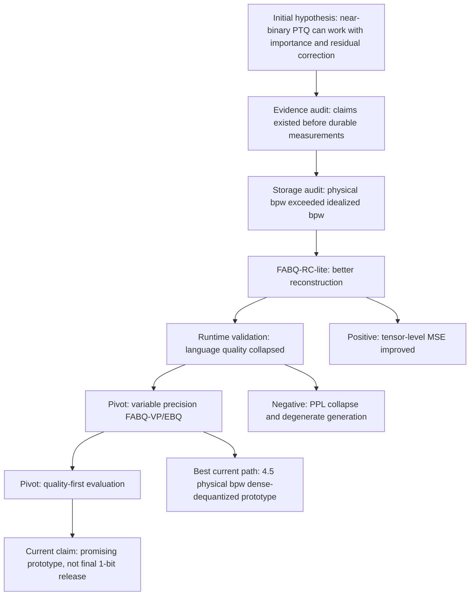
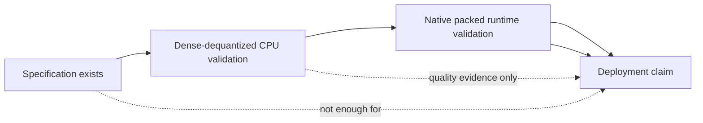
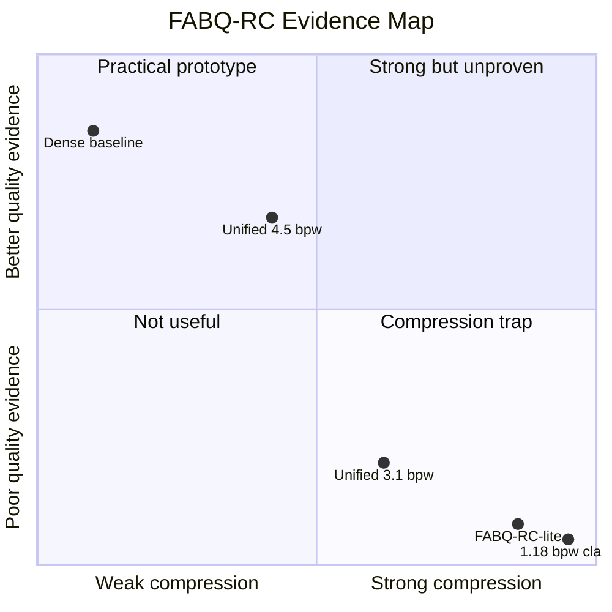

# FABQ-RC Project Story: A Scientific Narrative of Failures, Pivots, and Current Evidence

**Date:** 2026-07-02  
**Project:** FABQ-RC, Fisher-Adaptive Binary Quantization with Residual Codebooks  
**Status:** Active research prototype, not a final benchmark release

## Abstract

FABQ-RC began with a simple research question: can an existing dense language model be pushed toward the binary or near-binary storage regime without destroying useful model behavior? The initial hypothesis was that a binary quantizer might become viable if it stopped treating all weights equally. The proposed method combined Fisher-style importance, mixed precision protection for sensitive rows, adaptive block sizes, and residual codebooks to correct systematic binary error.

The project has not yet produced a validated 1-bit or 27B deployment claim. Its value so far is different: it has exposed which parts of the idea survive contact with measurement and which parts fail. A simplified FABQ-RC-lite prototype improved weight reconstruction over fixed binary baselines on Qwen3.5-0.8B, but it catastrophically failed language-model quality when applied end to end. A later variable-precision FABQ-VP/EBQ prototype recovered much of the lost quality around 4.5 physical bits per weight, but it did so by moving away from the original near-binary target. A storage audit also showed that older 1.18 to 1.21 bpw claims were not supported by physical storage accounting.

The current scientific framing is therefore not "FABQ-RC wins." It is: near-binary post-training quantization is fragile; reconstruction metrics alone are insufficient; residual correction and variable precision are necessary; and future claims must be judged by task quality, physical size, and native runtime behavior rather than by idealized bpw targets or perplexity alone.

## Visual and Equation Companion

The story can be rendered with three kinds of supporting material:

- Mermaid diagrams for the research path and failure/pivot structure.
- LaTeX equations for the quantization objective, storage accounting, and quality gate.
- Python plotting snippets for the measured tables.



At the highest level, the project is now framed by a quality-per-byte objective:

$$
Q^\* =
\arg\max_{q \in \mathcal{Q}}
\frac{\operatorname{Quality}(M_q; \mathcal{T})}
     {\operatorname{PhysicalBytes}(M_q)}
\quad
\text{subject to}
\quad
\Delta\operatorname{Quality}(M_q, M_{\text{dense}}) \le \epsilon .
$$

Here \(M_q\) is a quantized model produced by candidate method \(q\), \(\mathcal{T}\) is the task suite, and \(\epsilon\) is the allowed quality drop from the dense baseline.

## 1. Research Motivation

The starting motivation was practical. Large language models are useful, but dense weights make them expensive to store, move, and run. Weight-only post-training quantization promises to reduce this burden without retraining the model from scratch. The mature part of the field is mostly 3-bit to 8-bit quantization. The more interesting and dangerous regime is 1-bit to 2-bit quantization: the compression is attractive, but the model can collapse.

FABQ-RC was an attempt to make that extreme regime less brittle. The design intuition was:

1. Some rows or channels matter more than others.
2. A fixed global block size is unlikely to be optimal for every layer.
3. Binary quantization leaves residual structure that should be modeled, not ignored.
4. A small amount of higher precision may protect the model from the worst failures.

This led to the initial method shape:

- Estimate importance with Fisher-style sensitivity or proxies.
- Keep a small fraction of high-importance rows in int4.
- Quantize the remaining rows to binary.
- Select block size per layer.
- Add residual codebook correction for systematic binarization error.

In notation, the intended row-sensitivity signal was a Fisher-style score:

$$
F_{l,i} =
\mathbb{E}_{(x,y) \sim \mathcal{D}}
\left[
\left\|
\frac{\partial \mathcal{L}(x,y;\theta)}
     {\partial W_{l,i,:}}
\right\|_2^2
\right],
$$

where \(W_{l,i,:}\) is row \(i\) of layer \(l\). The binary path reconstructs a block with a learned or estimated scale:

$$
\hat{W}_{l,i,j} =
s_{l,i,b(j)} \cdot \operatorname{sign}(W_{l,i,j}),
$$

and the residual-codebook version adds a learned correction:

$$
\tilde{W}_{l,b} =
\hat{W}_{l,b} + C_{q(l,b), k(l,b)}.
$$

The full method hypothesis was that \(F\), adaptive block sizes, and \(C\) together could reduce the downstream loss induced by binary quantization.

The central research bet was that the right allocation and correction scheme might make near-binary storage viable for useful language modeling.

## 2. Initial Hypothesis

The original hypothesis had three layers.

First, FABQ-RC should beat naive fixed binary quantization at the same general storage scale because it preserves sensitive rows and adapts block sizes.

Second, residual codebooks should repair enough of the binary approximation error to keep model quality usable.

Third, the full method might approach the advertised 1.18 to 1.21 bpw regime while remaining useful for language modeling and eventually for GGUF-style deployment.

This hypothesis was plausible, but it depended on several assumptions that had not yet been proven:

- That row importance proxies would correlate with downstream quality.
- That better reconstruction would translate into better language behavior.
- That residual codebooks would be implemented correctly and would matter at model scale.
- That the storage math matched the public-facing bpw claims.
- That native kernels and GGUF packaging would actually run, not merely exist as design artifacts.

The later work mostly consisted of testing and narrowing these assumptions.

## 3. First Failure: The Repo Had Claims Before It Had Measurements

The first serious failure was not a model failure. It was an evidence failure.

The repository contained strong claims and ambitious specs, but the validation memo found that several public-facing claims were predictions rather than checked-in results. The older 1.18 bpw and 1.21 bpw claims were present in documentation, but no corresponding measured artifact or complete perplexity log existed in the repo for the published 27B model. The notebooks contained evaluation code, but not checked-in output cells with measured numbers. The model-card surface had metadata and intended results, not a verified benchmark trail.

That changed the research posture. The project could no longer be framed as "we have a final method and need to optimize it." It had to be framed as "we have a method hypothesis and need to validate the floor."

The decision logic at this point was simple: stop adding compression tricks until the baseline claims were audited. A new optimization layer on top of an unmeasured baseline would only make the uncertainty harder to untangle.

## 4. Second Failure: Physical Storage Did Not Match the Idealized BPW Story

The next failure was the storage audit.

Older project text discussed targets around 1.18 to 1.21 bpw. A direct walk through the implemented format showed that those numbers did not match physical storage. For a representative 3840 x 3840 layer with 5% int4 rows and 95% binary rows, physical storage was closer to:

| Blocksize | Approx. storage per layer | Physical bpw, excluding global codebook |
|---:|---:|---:|
| 64 | 3.18 MB | 1.73 |
| 128 | 2.86 MB | 1.55 |
| 256 | 2.69 MB | 1.46 |
| 512 | 2.61 MB | 1.42 |

The likely mismatch was logical bits versus physical storage. Logical binary payloads are not the whole artifact. A real format also carries scales, row maps, block metadata, codebook indices, headers, and packing overhead.

The accounting failure is captured by the difference between logical payload bpw and physical bpw:

$$
\operatorname{bpw}_{\text{logical}} =
\frac{B_{\text{weight-payload}}}{N_{\text{weights}}},
$$

$$
\operatorname{bpw}_{\text{physical}} =
\frac{
B_{\text{weight-payload}}
+ B_{\text{scales}}
+ B_{\text{row-maps}}
+ B_{\text{block-metadata}}
+ B_{\text{codebooks}}
+ B_{\text{headers}}
}{N_{\text{weights}}}.
$$

The project only becomes externally comparable when it reports \(\operatorname{bpw}_{\text{physical}}\), not only \(\operatorname{bpw}_{\text{logical}}\).

```python
# Plot the physical storage audit from the validation memo.
import matplotlib.pyplot as plt

blocks = [64, 128, 256, 512]
bpw = [1.73, 1.55, 1.46, 1.42]

fig, ax = plt.subplots(figsize=(6, 3.5))
ax.plot(blocks, bpw, marker="o", linewidth=2)
ax.axhline(1.21, color="tab:red", linestyle="--", label="old 1.21 bpw claim")
ax.axhline(1.18, color="tab:orange", linestyle=":", label="old 1.18 bpw claim")
ax.set_xscale("log", base=2)
ax.set_xticks(blocks)
ax.set_xticklabels([str(b) for b in blocks])
ax.set_xlabel("Binary blocksize")
ax.set_ylabel("Physical bpw")
ax.set_title("Physical storage exceeds the idealized bpw story")
ax.legend()
fig.tight_layout()
plt.show()
```

This forced a second pivot in how the project talks about compression. The publishable quantity is physical storage bpw and real artifact size, not idealized payload bpw. The old 1.18 to 1.21 bpw story should not be repeated as a measured result.

## 5. Third Failure: Two GGUF Specs and Incomplete Runtime Proof

The validation memo also found a specification consistency problem. There were two GGUF format descriptions in the repo, and they disagreed on layout details. One root spec described a simpler block structure, while the newer Gemma streaming path described a different layout with separate scales and metadata.

This matters scientifically because format claims are part of the experiment. If there are two incompatible specs, then "GGUF support" is not a single measurable claim. It becomes ambiguous which format is being validated.

The native runtime story was also incomplete. CUDA code existed, but the local environment was CPU-only and could not build or run the CUDA path. Some tests covered storage or Python round trips, and some CUDA tests existed, but the full matrix of block sizes and native compressed inference behavior was not proven locally.

The pivot here was to separate three categories:

- Spec exists.
- CPU dense-dequantized validation runs.
- Native packed runtime is measured.

Only the second category had useful local runtime evidence. The native speed and memory story remained open.



## 6. Fourth Failure: Padded Tail Blocks Contaminated Residual Codebook Sampling

The first concrete algorithmic bug was in residual/codebook sampling for tail blocks. Some residual collection paths included padded blocks. That meant artificial padding values could contaminate centroid learning, especially when incomplete tail blocks carried outliers or zeros unrelated to real weight structure.

This failure was important because the residual codebook is not a cosmetic part of FABQ-RC. It is one of the mechanisms expected to rescue binary quantization. If its training samples include padding artifacts, the codebook can learn the wrong correction.

The fix was to skip incomplete tail blocks before residual samples are appended to shared codebook training. A regression test now covers the failure shape: a short tail block with a large outlier should not move a one-cluster centroid when that tail block is skipped.

The pivot was from notebook-level patching to shared code plus a test. That matters because the next failures should be model failures, not bookkeeping failures.

The bug can be expressed as a sampling-domain problem. Residual codebooks should be trained on real blocks only:

$$
\mathcal{R}_{\text{train}} =
\left\{
W_{l,b} - \hat{W}_{l,b}
\;|\;
\operatorname{len}(W_{l,b}) = B
\right\}.
$$

Including padded tail blocks changes the empirical residual distribution:

$$
\mathcal{R}_{\text{bad}} =
\mathcal{R}_{\text{train}}
\cup
\left\{
W_{l,b}^{\text{tail}} - \hat{W}_{l,b}^{\text{tail}}
\right\},
$$

which means k-means may learn centroids partly from padding artifacts instead of model weights.

## 7. First Positive Result: Weight Reconstruction Improved

The first clean positive result was a weight-level benchmark on Qwen3.5-0.8B.

The benchmark covered:

- 244 target tensors.
- 615,579,648 target weights.
- 2D tensors only.
- Excluded embeddings, `lm_head`, routers, norms, and bias tensors.

The simplified method, FABQ-RC-lite, used row energy as a Fisher proxy, kept 5% of rows in int4, binarized the rest, selected a block size, and omitted the full residual codebook.

| Method | MSE | SQNR dB | bpw |
|---|---:|---:|---:|
| int8 rowwise symmetric | 1.779195e-08 | 40.5900 | 8.0131 |
| int4 rowwise symmetric | 5.767223e-06 | 15.4826 | 4.0131 |
| Q1 block64 | 7.627237e-05 | 4.2685 | 1.2500 |
| Q1 block128 | 7.701788e-05 | 4.2263 | 1.1250 |
| Q1 block256 | 7.751190e-05 | 4.1985 | 1.0625 |
| Q1 block512 | 7.792983e-05 | 4.1752 | 1.0322 |
| FABQ-RC-lite | 6.615134e-05 | 4.8868 | 1.4010 |

The reconstruction metrics are:

$$
\operatorname{MSE}(W,\hat{W}) =
\frac{1}{N}\sum_{i,j}(W_{i,j} - \hat{W}_{i,j})^2,
$$

$$
\operatorname{SQNR}_{dB} =
10 \log_{10}
\left(
\frac{\mathbb{E}[W^2]}
     {\mathbb{E}[(W-\hat{W})^2]}
\right).
$$

```python
# Plot the Qwen3.5-0.8B reconstruction table.
import matplotlib.pyplot as plt

methods = ["Q1 b64", "Q1 b128", "Q1 b256", "Q1 b512", "FABQ-RC-lite"]
mse = [7.627237e-05, 7.701788e-05, 7.751190e-05, 7.792983e-05, 6.615134e-05]
bpw = [1.2500, 1.1250, 1.0625, 1.0322, 1.4010]

fig, ax = plt.subplots(figsize=(6.5, 3.8))
scatter = ax.scatter(bpw, mse, s=80)
for x, y, label in zip(bpw, mse, methods):
    ax.annotate(label, (x, y), xytext=(5, 5), textcoords="offset points")
ax.set_xlabel("Bits per weight")
ax.set_ylabel("MSE")
ax.set_title("FABQ-RC-lite improves reconstruction, but at higher storage")
ax.grid(True, alpha=0.3)
fig.tight_layout()
plt.show()
```

FABQ-RC-lite reduced MSE by 13.3% versus Q1 block64 and 14.1% versus Q1 block128. That was real signal: adaptive row protection and binary block quantization could improve tensor reconstruction.

But this result also contained the next warning. The method was not smaller than the most aggressive fixed binary baselines. It paid extra storage for better reconstruction. The only honest claim was "better reconstruction at a higher near-binary storage budget."

## 8. Fifth Failure: Better Reconstruction Did Not Preserve Model Quality

The most decisive negative result came from dense-dequantized runtime validation.

The experiment took the simplified FABQ-RC-lite transformation, wrote dequantized weights back into a Transformers model, and ran forward loss plus generation. This did not test compressed-kernel speed. It tested whether the weight transformation preserved usable model behavior.

It did not.

| Model | Variant | Estimated bpw | PPL |
|---|---|---:|---:|
| Qwen3.5-0.8B | Dense BF16 | n/a | 26.5952 |
| Qwen3.5-0.8B | FABQ-RC-lite dequantized | 1.4010 | 677,505.3533 |
| Qwen3-0.6B | Dense BF16 | n/a | 35.2165 |
| Qwen3-0.6B | FABQ-RC-lite dequantized | 1.4004 | 3,676,448.8825 |

This was not a mild regression. It was a collapse.

The scientific lesson was that reconstruction error is not a sufficient objective for extreme LLM quantization. A tensor can become closer under MSE while the transformer becomes unusable. The project had to stop treating weight reconstruction as a proxy for model success.

The decision logic changed again:

- Reconstruction benchmarks are allowed as diagnostics.
- End-to-end model behavior is the real target.
- Any method that only wins reconstruction but fails generation quality is not a success.

```python
# Plot the collapse in end-to-end model quality.
import matplotlib.pyplot as plt

labels = ["Qwen3.5 dense", "Qwen3.5 FABQ-lite", "Qwen3 dense", "Qwen3 FABQ-lite"]
ppl = [26.5952, 677505.3533, 35.2165, 3676448.8825]

fig, ax = plt.subplots(figsize=(7, 3.8))
ax.bar(labels, ppl, color=["tab:blue", "tab:red", "tab:blue", "tab:red"])
ax.set_yscale("log")
ax.set_ylabel("Perplexity, log scale")
ax.set_title("Reconstruction gains did not preserve language quality")
ax.tick_params(axis="x", rotation=20)
fig.tight_layout()
plt.show()
```

## 9. Sixth Failure: PPL Alone Was Too Narrow a Success Criterion

For a while, the project used perplexity as the main end-to-end quality check. That was a reasonable first move because perplexity is easy to compute and sensitive to major failures. But it created a second measurement trap. PPL can detect collapse, but PPL alone does not fully answer whether a compressed model is useful.

The project therefore pivoted again: quality/task accuracy should become the primary gate, with perplexity treated as diagnostic. A new helper path, `benchmarks/benchmark_quality.py`, scores multiple-choice or cloze tasks by continuation loss and reports task accuracy as the primary metric.

The first local dense quality smoke used the Qwen3-0.6B checkpoint at `results/qwen3_06b_bin_checkpoint` and scored:

| Model path | Tasks | Correct | Accuracy |
|---|---:|---:|---:|
| `results/qwen3_06b_bin_checkpoint` | 3 | 2 | 0.6667 |

This is only a smoke baseline. The suite is intentionally tiny, and no quantized candidate comparison was supplied. The point is not that 2/3 is a serious model claim. The point is that the project now has a quality-first evaluation path and a clearer rule: future acceptance should be based on task quality relative to a dense or credible baseline, not raw PPL alone.

The quality-first gate is:

$$
\operatorname{Accuracy}(M;\mathcal{T}) =
\frac{1}{|\mathcal{T}|}
\sum_{t \in \mathcal{T}}
\mathbf{1}\left[
\operatorname{pred}(M,t) = y_t
\right],
$$

$$
\operatorname{Pass}(M_q) =
\left[
\operatorname{Accuracy}(M_{\text{dense}};\mathcal{T})
-
\operatorname{Accuracy}(M_q;\mathcal{T})
\le \epsilon
\right].
$$

For multiple-choice or cloze tasks, the current helper chooses the continuation with the lowest average loss:

$$
\operatorname{pred}(M,t) =
\arg\min_{c \in \mathcal{C}_t}
\frac{
\mathcal{L}_M(\operatorname{prompt}_t \oplus c)
}{N_c}.
$$

```python
# Minimal quality-task record compatible with benchmarks/benchmark_quality.py.
task = {
    "id": "capital_france",
    "prompt": "Question: What is the capital of France?\nA. Berlin\nB. Madrid\nC. Paris\nAnswer:",
    "choices": {"A": " A", "B": " B", "C": " C"},
    "answer": "C",
}
```

## 10. First Major Pivot: From Pure Near-Binary to Variable Precision

The FABQ-RC-lite collapse made the original near-binary direction too brittle in its simplified form. The next pivot was FABQ-VP/EBQ: instead of forcing 95% of rows into binary, allocate rows across int8, int4, int2, and binary.

The reasoning was empirical and conservative. If binary destroys behavior, increase capacity where sensitivity demands it. If 3 bpw is still poor, test 4 bpw and 4.5 bpw rather than pretending that the 1-bit target is already solved.

On Qwen3-0.6B, the variable-precision prototype produced:

| Target bpw | Estimated bpw | Mix | PPL |
|---:|---:|---|---:|
| Dense | n/a | n/a | 35.2165 |
| 3.0 | 3.1151 | 3% int8, 49% int4, 24% int2, 24% binary | 3269.7708 |
| 4.0 | 4.1432 | 5% int8, 85% int4, 10% int2 | 67.4850 |
| 4.5 | 4.5255 | 10% int8, 90% int4 | 42.5027 |

The variable-precision allocation can be written as:

$$
a_{l,i} \in \{8,4,2,1\},
\quad
\hat{W}_{l,i,:} = Q_{a_{l,i}}(W_{l,i,:}),
$$

with a physical bit budget:

$$
\frac{1}{N}
\sum_{l,i}
\left[
a_{l,i} \cdot d_{in,l}
+ B_{\text{scale}}(l,i)
+ B_{\text{metadata}}(l,i)
\right]
\le \beta .
$$

The empirical pivot is visible as a quality cliff:

```python
# Plot the variable-precision quality cliff on Qwen3-0.6B.
import matplotlib.pyplot as plt

estimated_bpw = [3.1151, 4.1432, 4.5255]
ppl = [3269.7708, 67.4850, 42.5027]
dense_ppl = 35.2165

fig, ax = plt.subplots(figsize=(6, 3.6))
ax.plot(estimated_bpw, ppl, marker="o", linewidth=2, label="FABQ-VP/EBQ")
ax.axhline(dense_ppl, color="tab:green", linestyle="--", label="dense")
ax.set_yscale("log")
ax.set_xlabel("Estimated physical bpw")
ax.set_ylabel("Perplexity, log scale")
ax.set_title("Variable precision backs away from the compression cliff")
ax.legend()
fig.tight_layout()
plt.show()
```

A later 1024-token local run used the local Qwen3-0.6B checkpoint and recorded dense BF16 PPL 50.7062 versus unified FABQ-VP/EBQ PPL 59.5981 at estimated 4.5255 bpw on the same 1016 scored WikiText-2 tokens.

This pivot produced the strongest current path. It did not prove the original 1-bit target. It showed that variable precision around 4.5 physical bpw could preserve much more quality than the near-binary shortcut.

The thought process became: if the model has a compression cliff, map the cliff instead of denying it. The 3.1 bpw result is not enough. The 4.5 bpw result is not final, but it is a usable foothold.

## 11. Second Major Pivot: From Claim-Driven to Evidence-Driven Writing

The writing surface also changed.

The repo already had ambitious stories: 27B, 1.18 bpw, GGUF, native inference, sub-byte compression. The evidence did not yet support those claims as final results. So the paper draft and Substack material were reframed around measured prototype evidence, negative results, and validation gaps.

The conservative framing became:

- FABQ-RC is a structured hypothesis for near-binary quantization.
- FABQ-RC-lite improves reconstruction but fails language quality.
- FABQ-VP/EBQ is the more promising near-term direction.
- The old bpw and 27B claims should be treated as unverified until a complete artifact and quality trail exists.

This pivot matters because research writing should not hide the failed path. In this project, the failure is the main scientific information. It tells us that the tempting shortcut, 5% int4 plus 95% binary plus row-energy proxy, is not enough.

## 12. What Failed, Categorized

### 12.1 Evidence and Reproducibility Failures

- Public-facing claims existed before corresponding checked-in eval logs.
- Published model metadata did not include enough local validation evidence.
- Notebooks contained evaluation code but not enough durable output.
- The 27B story remained unvalidated in the repository evidence surface.

### 12.2 Storage Accounting Failures

- Older 1.18 to 1.21 bpw claims counted an idealized or incomplete budget.
- Physical storage accounting showed roughly 1.42 to 1.73 bpw for representative layers depending on block size.
- The project needed to distinguish logical bpw, physical bpw, and final artifact size.

### 12.3 Specification and Runtime Failures

- Two GGUF specs disagreed.
- Native CUDA inference existed as code but was not locally built or benchmarked.
- Dynamic block size support was plausible in code, but not exhaustively tested across all advertised values.
- Dense-dequantized CPU validation could not support speedup claims.

### 12.4 Algorithmic Failures

- Tail-block padding could contaminate residual codebook sampling.
- Row-energy importance was too weak as a stand-in for full Fisher calibration.
- The simplified FABQ-RC-lite path omitted full residual codebooks.
- The aggressive 95% binary allocation destroyed model quality.

### 12.5 Measurement Failures

- Weight reconstruction improvement did not imply language-model quality.
- Perplexity detected collapse but was too narrow as a final quality gate.
- Throughput from dequantized dense weights did not prove native packed-runtime acceleration.
- Tiny smoke suites were useful for debugging but not publishable benchmarks.

## 13. What Survived

Several ideas survived the failures.

First, adaptive protection of important rows seems useful at the tensor level. FABQ-RC-lite did beat fixed binary reconstruction baselines.

Second, the residual/codebook idea remains scientifically plausible, but it still needs full validation after the tail-block fix. The current negative results do not falsify the full residual-codebook method because the simplified runtime harness did not include that full component.

Third, variable precision is clearly more promising than strict near-binary allocation in the tested prototypes. The 4.5 bpw FABQ-VP/EBQ result is not final, but it is the strongest current direction.

Fourth, quality-first evaluation is now the right acceptance frame. The project should report task accuracy, long-context quality, robustness, latency, memory, physical bpw, and only then PPL as a supporting diagnostic.

## 14. Current Scientific Claim

The defensible claim today is:

FABQ-RC is an active research prototype showing that Fisher- or importance-aware row protection can improve near-binary reconstruction, but the simplified near-binary form fails end-to-end model quality. A variable-precision extension recovers substantially more quality around 4.5 physical bpw, suggesting that calibrated mixed precision plus residual correction is a more realistic path than immediate 1-bit deployment. The project is not yet a validated 27B GGUF release or a proven native compressed inference backend.

That claim is weaker than the original ambition, but stronger scientifically because it is tied to evidence.

## 15. Current Best Evidence

| Evidence | Interpretation |
|---|---|
| Qwen3.5-0.8B weight benchmark: FABQ-RC-lite MSE 6.615134e-05 at 1.4010 bpw | Positive tensor-level signal versus fixed Q1 baselines |
| Qwen3.5-0.8B FABQ-RC-lite PPL 677,505 versus dense 26.5952 | End-to-end quality failure |
| Qwen3-0.6B FABQ-RC-lite PPL 3,676,448 versus dense 35.2165 | End-to-end quality failure repeated on text-only target |
| Qwen3-0.6B unified 4.5255 bpw PPL 59.5981 versus dense 50.7062 on 1016 tokens | Strongest current local quality path, still behind dense |
| Dense Qwen3-0.6B quality smoke: 2/3 task accuracy | First quality-first artifact, only a smoke baseline |
| Tail-block regression passes | One concrete residual-codebook bug fixed |
| Storage audit: 1.42 to 1.73 physical bpw representative range | Older 1.18 to 1.21 bpw claims not validated |



## 16. Current Research Direction

The next phase should not chase a lower number first. It should chase a better answer to the quality-per-byte question.

The recommended path is:

1. Build a real dense-vs-quantized quality benchmark suite beyond the 3-task smoke.
2. Run the fixed FABQ-RC residual-codebook path end to end.
3. Evaluate variable precision at matched physical sizes against fixed int4, fixed int2, Q1, and a credible external low-bit baseline.
4. Report task accuracy, generation sanity, long-context degradation, latency, memory, and physical artifact size.
5. Only make speed claims after native packed kernels or a real backend path are measured.
6. Consolidate the GGUF spec before publishing compatibility claims.

The guiding question should be:

> At a fixed physical size and runtime target, which method preserves the most task quality?

That question is better than "how low can bpw go?" because it penalizes compression that destroys the model.

## 17. Final Framing

FABQ-RC has gone through the kind of failure sequence that useful research projects often go through.

The first story was too clean: a near-binary method with residual codebooks might deliver extreme compression. The measurements complicated that story. Storage was higher than advertised. The full published-model evidence was missing. A real bug affected residual sampling. The simplified near-binary method improved reconstruction but destroyed model quality. Variable precision rescued part of the idea, but only by moving away from the pure near-binary target. Finally, the evaluation frame moved from PPL-first to quality-first because the project needs to know whether the compressed model can still solve tasks.

The project is therefore not a failed repo. It is a partially falsified hypothesis with a better successor hypothesis.

The falsified part is the shortcut: reconstruction improvement plus aggressive binary allocation is not enough. The surviving part is the broader research direction: importance-aware mixed precision, residual correction, and quality-per-byte evaluation may still produce a useful compression method if validated honestly against strong baselines.

That is the scientific story: not a straight line to a win, but a narrowing of the search space through measurement.
