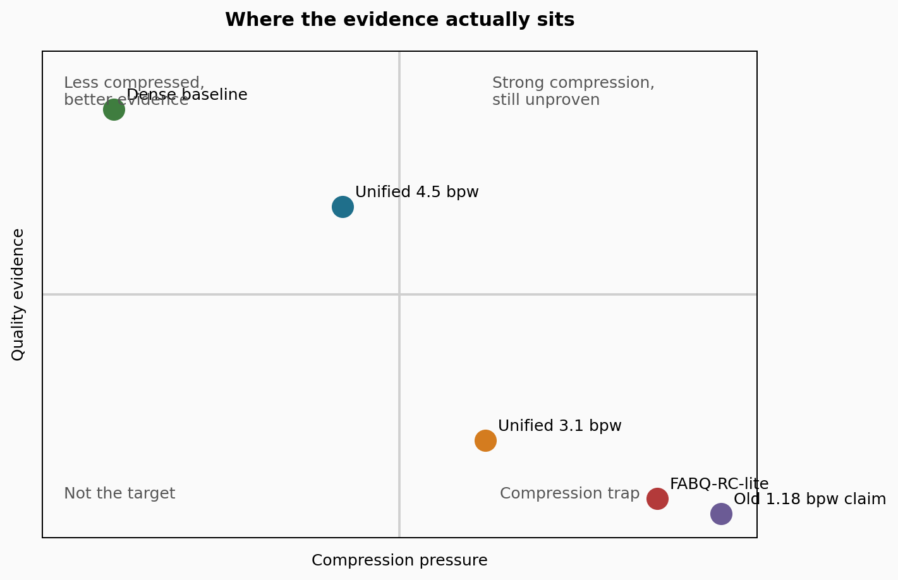
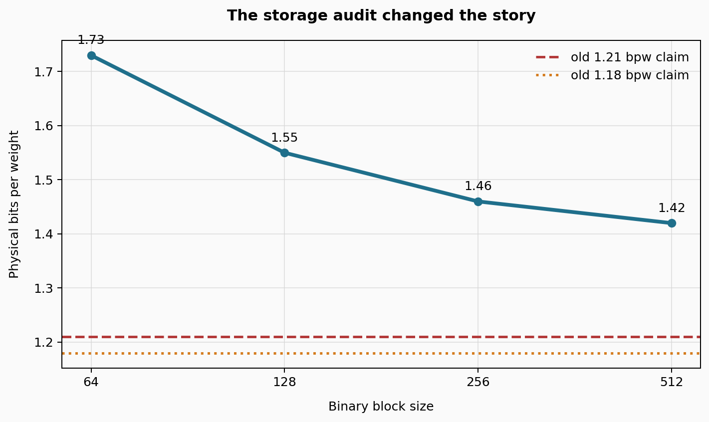
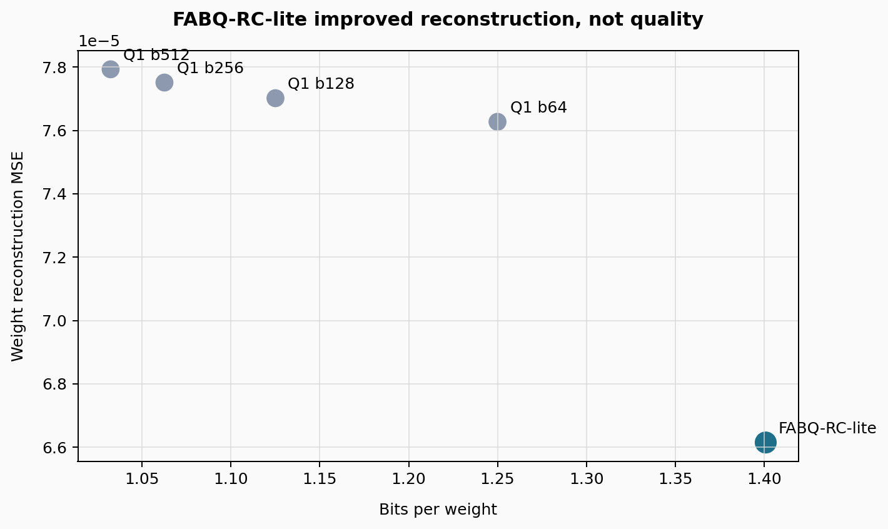
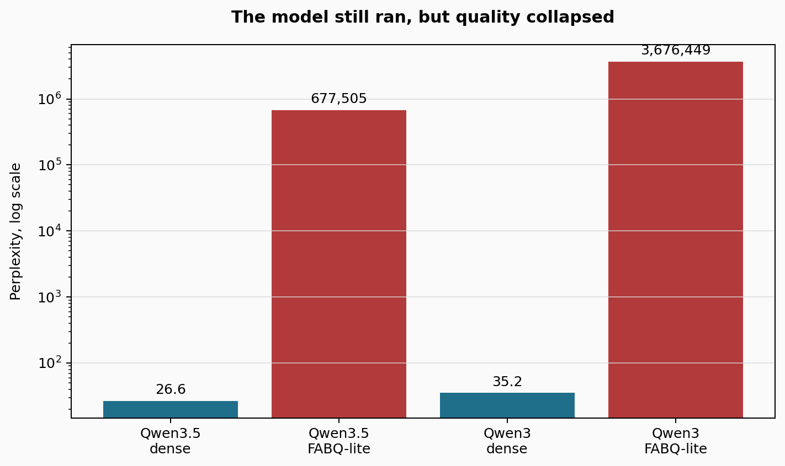
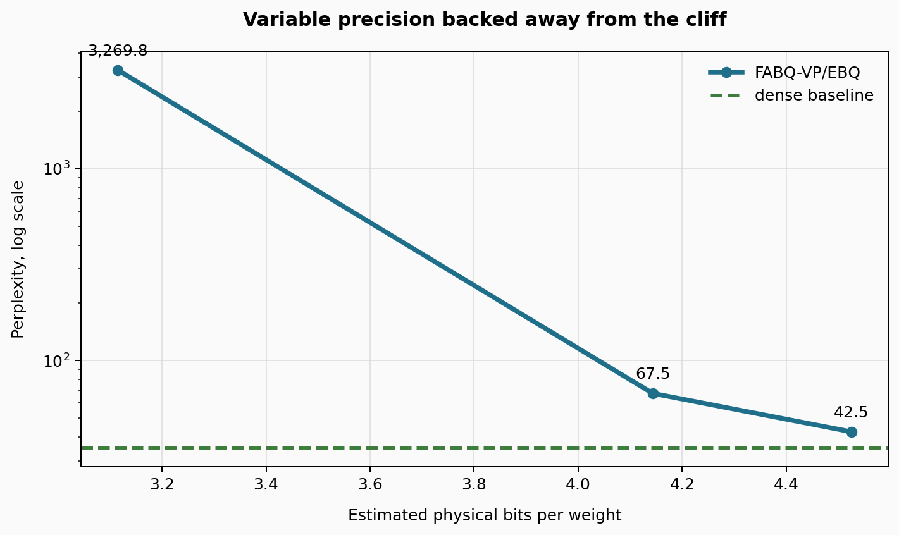

# The Research Story Behind FABQ-RC

**Subtitle:** A near-1-bit quantization project did not become a clean success story. It became something more useful: a map of what fails, what survives, and what has to be measured next.

**Suggested slug:** `fabq-rc-research-story-failures-pivots`

**Suggested header image:** `assets/fabq_evidence_map.png`

---

I started FABQ-RC with a simple question:

> Can an existing dense language model be pushed toward binary or near-binary weights without destroying useful behavior?

The first version of the story was tempting. Use Fisher-style importance to find sensitive rows. Keep a small high-precision core. Push the rest toward binary. Add residual codebooks to repair systematic binarization error. Package it in a compact format. Maybe this gets close to a usable 1-bit post-training quantizer.

That is the clean version.

The real version is more interesting.

FABQ-RC did not turn into a straight-line win. It turned into a sequence of failed assumptions, measurement pivots, and a better research question.

The current lesson is not:

> FABQ-RC beats everything.

The current lesson is:

> Near-binary quantization is fragile, reconstruction metrics can lie, and the right target is quality per physical byte.



*Figure 1. The current evidence map. Dense baselines are high-quality but weakly compressed. FABQ-RC-lite is strongly compressed but fails quality. The variable-precision prototype is the first usable foothold.*

## The Original Bet

FABQ-RC stands for **Fisher-Adaptive Binary Quantization with Residual Codebooks**.

The design had four pieces:

1. Estimate which rows or channels matter most.
2. Keep a small important slice at higher precision.
3. Quantize the rest aggressively, often to binary.
4. Use residual codebooks to correct errors left by binarization.

The intended importance score was Fisher-like:

```latex
F_{l,i} =
\mathbb{E}_{(x,y) \sim \mathcal{D}}
\left[
\left\|
\frac{\partial \mathcal{L}(x,y;\theta)}
     {\partial W_{l,i,:}}
\right\|_2^2
\right]
```

In plain English: if changing a row would change the loss a lot, protect that row.

The binary reconstruction looked like this:

```latex
\hat{W}_{l,i,j} =
s_{l,i,b(j)} \cdot \operatorname{sign}(W_{l,i,j})
```

And the residual-codebook version added a correction:

```latex
\tilde{W}_{l,b} =
\hat{W}_{l,b} + C_{q(l,b), k(l,b)}
```

The bet was that importance, adaptive block sizes, and residual correction could make near-binary weights usable.

## The First Problem: The Claims Were Ahead of the Evidence

The first serious failure was not a model failure. It was an evidence failure.

The repository had ambitious claims around 1.18 to 1.21 bits per weight and a future 27B deployment story. But the checked-in evidence did not yet support those claims as measured results.

There were notebooks with evaluation code. There were model-card claims. There were format specs. But there was not a durable, repo-grounded benchmark trail proving the advertised 27B result.

That changed the posture of the project.

Instead of asking:

> How do we squeeze this even smaller?

The right question became:

> What has actually been measured?

That sounds boring. It was the most important pivot.

## The Storage Audit Changed the Story

The next failure was storage accounting.

The older story talked about 1.18 to 1.21 bpw. But a walk through the implemented format showed that physical storage was higher once scales, row maps, block metadata, headers, and codebook-related overhead were counted.



*Figure 2. The older bpw claims were below the measured physical storage implied by the implemented format.*

The useful equation is the difference between logical bpw and physical bpw:

```latex
\operatorname{bpw}_{\text{logical}} =
\frac{B_{\text{weight-payload}}}{N_{\text{weights}}}
```

```latex
\operatorname{bpw}_{\text{physical}} =
\frac{
B_{\text{weight-payload}}
+ B_{\text{scales}}
+ B_{\text{row-maps}}
+ B_{\text{block-metadata}}
+ B_{\text{codebooks}}
+ B_{\text{headers}}
}{N_{\text{weights}}}
```

For a representative 3840 x 3840 layer with 5% int4 rows and 95% binary rows, the physical range was closer to 1.42 to 1.73 bpw depending on block size.

That is still very compressed.

But it is not the same claim as 1.18 bpw.

From that point on, the project had to treat **physical bpw** as the real number.

## The First Real Positive Result

The cleanest positive result came from a weight reconstruction benchmark on `Qwen/Qwen3.5-0.8B`.

The simplified method was called **FABQ-RC-lite**. It used row energy as a cheap importance proxy, kept 5% of rows in int4, binarized the rest, selected a block size, and did not include the full residual codebook.

It beat fixed binary block baselines on reconstruction error.



*Figure 3. FABQ-RC-lite improved reconstruction error versus fixed Q1 baselines, but at a higher near-binary storage budget.*

The core reconstruction metrics were:

```latex
\operatorname{MSE}(W,\hat{W}) =
\frac{1}{N}\sum_{i,j}(W_{i,j} - \hat{W}_{i,j})^2
```

```latex
\operatorname{SQNR}_{dB} =
10 \log_{10}
\left(
\frac{\mathbb{E}[W^2]}
     {\mathbb{E}[(W-\hat{W})^2]}
\right)
```

The result was real but narrow:

- FABQ-RC-lite MSE: `6.615134e-05`
- Q1 block64 MSE: `7.627237e-05`
- Q1 block128 MSE: `7.701788e-05`
- FABQ-RC-lite storage: `1.4010 bpw`

That was a useful signal.

But it also set a trap.

It was easy to say: the tensor got closer, so the model should be better.

That turned out to be false.

## The Main Failure: Reconstruction Did Not Preserve Quality

The next experiment applied the simplified FABQ-RC-lite transformation, dequantized the weights back into a dense Transformers model, and ran forward loss plus generation.

This was not a native compressed-kernel benchmark. It did not prove speed. It only answered one question:

> Does the transformed model still behave like a language model?

The answer was no.



*Figure 4. The model still loaded and ran, but language-model quality collapsed.*

The numbers were not close:

| Model | Variant | Estimated bpw | PPL |
|---|---|---:|---:|
| Qwen3.5-0.8B | Dense BF16 | n/a | 26.5952 |
| Qwen3.5-0.8B | FABQ-RC-lite | 1.4010 | 677,505.3533 |
| Qwen3-0.6B | Dense BF16 | n/a | 35.2165 |
| Qwen3-0.6B | FABQ-RC-lite | 1.4004 | 3,676,448.8825 |

That is not a small regression.

That is collapse.

The failure was useful because it killed a bad shortcut:

> Better reconstruction does not automatically mean preserved language quality.

For LLM quantization, that distinction is everything.

## The Bug That Had to Be Fixed First

There was also a concrete implementation failure.

Some residual-codebook sampling paths included padded tail blocks. That means artificial padding values could enter the residual distribution used for codebook learning.

The correct residual training set should include full real blocks:

```latex
\mathcal{R}_{\text{train}} =
\left\{
W_{l,b} - \hat{W}_{l,b}
\;|\;
\operatorname{len}(W_{l,b}) = B
\right\}
```

The bad version included incomplete tail blocks:

```latex
\mathcal{R}_{\text{bad}} =
\mathcal{R}_{\text{train}}
\cup
\left\{
W_{l,b}^{\text{tail}} - \hat{W}_{l,b}^{\text{tail}}
\right\}
```

This matters because residual codebooks are supposed to learn model error, not padding artifacts.

The fix was to skip incomplete tail blocks before appending residual samples. That now has a regression test.

This did not validate the full method by itself. It removed one blocker so the next result would be about the method, not the bookkeeping.

## The Pivot: Variable Precision

After the FABQ-RC-lite collapse, the project had to stop pretending that 95% binary rows were harmless.

The next direction was **FABQ-VP/EBQ**: variable precision and error-budget allocation.

Instead of forcing most rows into binary, assign rows across int8, int4, int2, and binary:

```latex
a_{l,i} \in \{8,4,2,1\},
\quad
\hat{W}_{l,i,:} = Q_{a_{l,i}}(W_{l,i,:})
```

The budget is physical, not idealized:

```latex
\frac{1}{N}
\sum_{l,i}
\left[
a_{l,i} \cdot d_{in,l}
+ B_{\text{scale}}(l,i)
+ B_{\text{metadata}}(l,i)
\right]
\le \beta
```

The results showed a quality cliff.



*Figure 5. The 3.1 bpw prototype was still poor. Around 4.5 physical bpw, the model became much closer to dense.*

On Qwen3-0.6B:

| Target bpw | Estimated bpw | Mix | PPL |
|---:|---:|---|---:|
| Dense | n/a | n/a | 35.2165 |
| 3.0 | 3.1151 | 3% int8, 49% int4, 24% int2, 24% binary | 3269.7708 |
| 4.0 | 4.1432 | 5% int8, 85% int4, 10% int2 | 67.4850 |
| 4.5 | 4.5255 | 10% int8, 90% int4 | 42.5027 |

A later 1024-token local run found:

- Dense BF16 PPL: `50.7062`
- Unified FABQ-VP/EBQ at `4.5255 bpw`: `59.5981`
- Same 1016 scored WikiText-2 tokens

That is still behind dense.

But it is no longer collapse.

The pivot did not prove the original 1-bit dream. It showed the first realistic path away from failure.

## The Evaluation Pivot: Quality First, PPL Second

For a while, perplexity was the main pass/fail metric.

That made sense early because PPL catches catastrophic failure quickly. But it is too narrow as a final research target. A compressed model should be judged on whether it still solves tasks, generates stably, preserves long-context behavior, and runs within the intended memory and latency budget.

So the current evaluation frame is:

```latex
\operatorname{Accuracy}(M;\mathcal{T}) =
\frac{1}{|\mathcal{T}|}
\sum_{t \in \mathcal{T}}
\mathbf{1}\left[
\operatorname{pred}(M,t) = y_t
\right]
```

And the quality gate is:

```latex
\operatorname{Pass}(M_q) =
\left[
\operatorname{Accuracy}(M_{\text{dense}};\mathcal{T})
-
\operatorname{Accuracy}(M_q;\mathcal{T})
\le \epsilon
\right]
```

The first local quality smoke is intentionally tiny:

| Model path | Tasks | Correct | Accuracy |
|---|---:|---:|---:|
| `results/qwen3_06b_bin_checkpoint` | 3 | 2 | 0.6667 |

That is not a serious benchmark claim.

It is a signpost: from now on, task quality is the primary gate and PPL is a diagnostic.

## What Failed

Here is the failure list, stripped of drama:

- The repo had claims before it had durable measurements.
- The physical storage budget was higher than the old idealized bpw story.
- Two GGUF specs disagreed.
- Native packed runtime was not measured.
- Tail-block padding contaminated residual sampling until fixed.
- FABQ-RC-lite improved reconstruction but failed language quality.
- PPL alone was too narrow as the final acceptance criterion.

That is a lot of failure.

It is also a useful map.

## What Survived

Several ideas are still alive:

- Importance-aware row protection helped tensor reconstruction.
- Residual correction remains plausible, but needs full end-to-end validation.
- Variable precision is much more promising than strict near-binary allocation.
- Physical bpw and real artifact size must be reported.
- Quality-per-byte is the right research target.

The current objective is:

```latex
Q^\* =
\arg\max_{q \in \mathcal{Q}}
\frac{\operatorname{Quality}(M_q; \mathcal{T})}
     {\operatorname{PhysicalBytes}(M_q)}
\quad
\text{subject to}
\quad
\Delta\operatorname{Quality}(M_q, M_{\text{dense}}) \le \epsilon
```

In plain English:

> At a fixed physical size and runtime target, which method preserves the most task quality?

That is a better question than:

> How low can the bpw number go?

Because a tiny model that cannot answer anything is not a useful compression result.

## The Honest Claim Today

The defensible claim is:

> FABQ-RC is an active research prototype showing that importance-aware row protection can improve near-binary reconstruction, but the simplified near-binary form fails end-to-end model quality. A variable-precision extension recovers substantially more quality around 4.5 physical bpw, suggesting that calibrated mixed precision plus residual correction is a more realistic path than immediate 1-bit deployment.

That is weaker than the original dream.

It is also much stronger scientifically.

## The Next Experiment

The next useful milestone is not a prettier claim.

It is a matched quality benchmark:

1. Dense baseline task accuracy.
2. Fixed int4 baseline.
3. Fixed int2 or Q1 baseline.
4. FABQ-RC with the tail-block fix.
5. FABQ-VP/EBQ at matched physical size.
6. Native runtime only when packed kernels are actually measured.

The project should report:

- Task accuracy
- Generation sanity
- Long-context degradation
- Physical bpw
- Artifact size
- Memory use
- Latency
- PPL as a diagnostic, not the headline

## Final Takeaway

FABQ-RC is not a clean victory story.

It is a research story.

The first hypothesis was too optimistic. The storage math got stricter. The simplified near-binary method failed. The variable-precision method recovered part of the idea. The evaluation target moved from "low bpw" to "quality per physical byte."

That is progress.

Not because the project already won.

Because the search space is now smaller, sharper, and harder to fool.

---

## Technical Appendix: Recreate the Figures

The charts in this post were generated from the checked-in result summaries with:

```bash
python paper/substack/generate_fabq_story_graphics.py
```

The image files are written to:

```text
paper/substack/assets/
```

For Substack, upload the PNG files directly and place each near the matching caption. Substack will not reliably render Mermaid diagrams or raw LaTeX, so this version uses images for the visual story and keeps equations in copyable code blocks.
