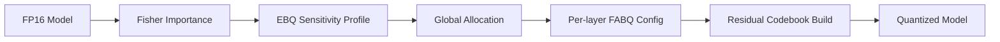

# FABQ-RC + Variable Precision Research Plan

**Date:** 2026-05-04
**Last Updated:** 2026-06-28
**Status:** Active

---

## Executive Summary

FABQ-RC is an active near-binary quantization prototype with:
- Fisher-weighted channel importance
- Adaptive per-layer blocksize selection
- Residual codebook for bias correction
- GGUF export work in progress

FABQ-VP and EBQ now have a dense-dequantized prototype path.

This plan covers two complementary research directions building on FABQ-RC:

1. **FABQ-VP** (Variable Precision Extension): Extend FABQ-RC's adaptive precision from 1-bit to 2-8 bits, targeting ~3-4 bpw for Qwen 35B
2. **EBQ** (Error-Budget Quantization): Global perplexity-constrained bit allocation for RAM-only LLM inference

**Goal:** Enable Qwen 35B inference on RAM-only systems (~13-16 GB weights) with <5% perplexity degradation.

---

## Current State

- The padded-block residual/codebook sampling bug is fixed in `gemma4-12b/streaming/fabq_rc_cuda/kmeans.py` and covered by `tests/test_kmeans.py`.
- The old `~1.18 bpw with good quality` claim is not validated by current checked-in results.
- Near-binary FABQ-RC-lite improves reconstruction but fails language-model quality.
- The strongest current path is dense-dequantized unified FABQ-VP/EBQ around 4.5 physical bpw.
- A 1024-token Qwen3-0.6B baseline now exists in `results/qwen3_06b_baseline_1024_report.md`.
- Going forward, quality/task accuracy is the primary evaluation gate. Perplexity remains useful as a diagnostic, but it should not be the main success criterion by itself.

---

## Phase 0: Validation (Blocks FABQ-VP/EBQ Work)

**Purpose:** Confirm FABQ-RC baseline before extending

### 0.1 Fix Padded-Block Centroid Bug

**Issue:** Cells 19 and 21 in FABQ_RC_Kaggle.ipynb compute residuals including padded blocks, skewing centroid computation.

**Fix Required:** Skip centroid assignment for blocks that contain padding.

**Status 2026-06-28:** Fixed in the shared codebook builder. Incomplete tail blocks are skipped before residual samples are added to k-means training. Regression coverage: `gemma4-12b/streaming/fabq_rc_cuda/tests/test_kmeans.py`.

**Verification:**
- Unit regression: passed locally on 2026-06-28.
- Full FABQ-RC residual-codebook evaluation with the fixed builder still needs to run before claiming the original FABQ-RC path is validated.
- Target for the full run: all layers > 0.98 cosine similarity, plus end-to-end perplexity on the same corpus as the dense baseline.

### 0.2 Baseline Quality Measurement

**Before extending, measure:**
1. Dense baseline quality/task accuracy on a fixed small benchmark suite
2. FABQ-RC (fixed) quality/task accuracy on the same prompts
3. Compare against Q1_0_g128 at same bpw
4. Compare against BiLLM or another credible low-bit baseline at similar bpw
5. Keep perplexity as a secondary diagnostic for regression triage

**Deliverable:** Validated quality-first baseline numbers for FABQ-RC v2

**Status 2026-06-28:** Partial PPL baseline established for Qwen3-0.6B. Dense BF16 PPL is 50.7062 over 1016 scored WikiText-2 tokens. Unified FABQ-VP/EBQ at estimated 4.5255 bpw reaches 59.5981 PPL on the same slice. See `results/qwen3_06b_baseline_1024_report.md`.

**Status 2026-07-02:** Quality-first helper added at `benchmarks/benchmark_quality.py`. The next validation run should record task accuracy for dense and quantized variants before treating PPL as decisive.

---

## Phase 1: FABQ-VP Prototype (3-4 sessions)

**Purpose:** Build and test variable-precision allocation on small model

### 1.1 Extend Precision Pyramid

**Changes to FABQ-RC allocation:**

| Precision | FABQ-RC | FABQ-VP |
|-----------|---------|---------|
| Levels | 2 (int8, binary) | 5 (fp16, int8, int4, int2, binary) |
| Bit range | 1.0-1.2 bpw | 2.0-4.0 bpw |
| Pyramid | Fixed 5%/95% | Learnable fractions |

**Implementation:**
```python
# Extend allocation function
def allocate_precision_pyramid(fisher_scores, pyramid={
    'fp16': 0.005,
    'int8': 0.045,
    'int4': 0.200,
    'int2': 0.250,
    'binary': 0.500
}):
    # Sort channels by Fisher
    # Assign to precision levels based on pyramid
    # Return allocation dict
```

### 1.2 Multi-Level Residual Codebooks

**Challenge:** FABQ-RC has 1 residual codebook (binary). FABQ-VP needs 3:
- int4 → int8 residuals
- int2 → int4 residuals  
- binary → int2 residuals

**Implementation:**
```python
def build_multi_residual_codebooks(layers, allocation):
    codebooks = {}
    
    for (lower, upper) in [('int2', 'int4'), ('binary', 'int2')]:
        residuals = []
        for layer in layers:
            upper_q = quantize_to(layer.weights, upper)
            lower_q = quantize_to(layer.weights, lower)
            residual = upper_q - lower_q
            residuals.extend(block samples)
        
        codebooks[(lower, upper)] = kmeans(residuals, n=256)
    
    return codebooks
```

### 1.3 Per-Layer Blocksize per Precision Level

**FABQ-RC only searches blocksize for binary weights.**  
**FABQ-VP needs blocksize search for int2 and int4 too.**

```python
# Blocksize candidates by precision
binary_candidates = [16, 32, 64, 128, 256]
int2_candidates = [32, 64, 128]
int4_candidates = [16, 32, 64]

def select_blocksize_for_precision(weights, fisher, precision, candidates):
    # Fisher-weighted reconstruction error minimization
    # Return best blocksize
```

### 1.4 Test on TinyLlama

**Why:** Fast iteration (1.1B model), same architecture as FABQ-RC validation

**Experiments:**
1. FABQ-VP at 3 bpw → measure perplexity
2. FABQ-VP at 4 bpw → measure perplexity
3. Compare against uniform 3-bit baseline
4. Compare against AWQ 4-bit baseline

**Success Criteria:**
- 3 bpw FABQ-VP within 5% of FP16 perplexity
- FABQ-VP 3 bpw beats uniform 3-bit baseline

---

## Phase 2: EBQ Prototype (2-3 sessions)

**Purpose:** Implement global error-budget allocation

### 2.1 Sensitivity Profiler

**Core function:** For each module, measure PPL delta for different bit-widths

```python
def profile_sensitivity(model, module_name, calibration_data):
    """
    Returns: {config: (ppl_delta, size_delta)}
    """
    base_ppl = run_with_module_fp16(model, module_name, calibration_data)
    
    sensitivities = {}
    for bits in [2, 3, 4, 6, 8]:
        for quantizer in ['per_channel', 'per_group_64']:
            ppl = run_with_module_quantized(
                model, module_name, bits, quantizer, calibration_data
            )
            sensitivities[f"{bits}b_{quantizer}"] = (ppl - base_ppl, size(bits))
    
    return sensitivities
```

**Speed optimization:** Only profile ~10 representative layers, interpolate for rest

### 2.2 Greedy Knapsack Allocator

**Input:** Sensitivity profiles + size target + PPL budget  
**Output:** Per-module bit-width allocation

```python
def error_budget_allocation(sensitivities, size_target, ppl_budget):
    # Start with 8-bit everywhere
    allocation = {m: '8b_per_channel' for m in sensitivities}
    
    # Priority: bits saved / ppl cost
    pq = build_priority_queue(sensitivities, allocation)
    
    while pq.not_empty():
        candidate = pq.pop()
        if meets_budgets(candidate, allocation, size_target, ppl_budget):
            apply_upgrade(allocation, candidate)
    
    return allocation
```

### 2.3 KV Cache Sensitivity Profiling

**Separate budget for KV cache** (important for long context)

```python
def profile_kv_sensitivity(model, calibration_data, seq_lengths):
    # Run at different sequence lengths
    # Measure PPL with 2/3/4/6/8-bit KV cache
    # Return kv_bits recommendation
```

### 2.4 Test on TinyLlama

**Experiments:**
1. EBQ at 3 bpw target → measure perplexity
2. EBQ at 3.5 bpw target → measure perplexity
3. Compare EBQ allocation vs uniform allocation

**Success Criteria:**
- EBQ allocation shows layer-wise variation (not uniform)
- EBQ 3 bpw within 5% of FP16

---

## Phase 3: Integration (2-3 sessions)

**Purpose:** Combine FABQ-VP (adaptive blocksize, residual codebook) with EBQ (global allocation)

### 3.1 Unified Calibration Pipeline



### 3.2 Storage Format

**Create FABQEBQContainer:**

```python
@dataclass
class FABQEBQContainer:
    format_version: int = 2
    hidden_size: int
    num_layers: int
    
    # EBQ config
    target_bpw: float
    ppl_budget: float
    allocation: List[LayerConfig]  # from knapsack
    
    # FABQ-RC config
    binary_blocksizes: List[int]  # per layer
    int2_blocksizes: List[int]   # per layer
    codebooks: Dict[str, np.ndarray]
    
    # Packed weights
    weight_data: bytes
```

### 3.3 Inference Kernels (CPU-focused)

**Goal:** Enable CPU inference without VRAM

1. **Streaming dequantization:** Load weights, dequant on-the-fly
2. **SIMD matmul:** int4/int8 AVX2/VNNI kernels
3. **KV cache management:** Quantized KV with dequant on attention

### 3.4 Test Integration

**Experiments:**
1. FABQ-VP + EBQ combined at 3 bpw on TinyLlama
2. FABQ-VP + EBQ combined at 3.5 bpw on TinyLlama
3. Measure perplexity and memory usage

---

## Phase 4: Qwen 35B Experiments (4-6 sessions)

**Purpose:** Apply to actual target model

### 4.1 FP16 Baseline

**First:** Measure Qwen 35B FP16 perplexity on WikiText2
**Establishes:** Base PPL for budget calculations

### 4.2 Full Calibration

**Steps:**
1. Load Qwen 35B FP16 (may need multi-GPU or CPU offload)
2. Run calibration on WikiText2 (~10K samples)
3. Compute Fisher importance
4. Profile sensitivities for representative layers
5. Run EBQ allocation with target bpw
6. Build FABQ-VP residual codebooks
7. Generate quantized model

**Challenges:**
- 35B model may not fit in single GPU
- Need to use CPU offload for some steps
- Calibration may take hours

**Solutions:**
- Use device_map='auto' for model loading
- Profile only 10-20 layers, interpolate
- Run overnight

### 4.3 Evaluation

**Quality benchmarks:**
- Fixed multiple-choice/cloze prompt suite with dense-vs-quantized task accuracy
- Generation sanity checks on fixed prompts
- WikiText2/C4 perplexity only as diagnostic regressions, not primary wins

**Downstream tasks:**
- ARC-Easy/Challenge
- HellaSwag
- TriviaQA (if time)

**Memory profiling:**
- Total RAM usage
- Peak VRAM (if any GPU used)

### 4.4 Target Metrics

| Metric | Target |
|--------|--------|
| Bits per parameter | ~3 bpw |
| Quality/task accuracy | Within 5% absolute accuracy drop vs dense baseline |
| WikiText2/C4 PPL | Diagnostic only |
| RAM usage | < 20 GB total |
| VRAM usage | 0 GB (CPU-only target) |

---

## Phase 5: Iteration and Refinement

**Ongoing based on results:**

1. **Adjust pyramid fractions** — learn from validation perplexity
2. **Refine EBQ allocation** — second-pass refinement
3. **Alternative quantizers** — try GPTQ, AWQ as backends
4. **KV cache tuning** — profile at actual context lengths used
5. **Documentation** — clean up for research community

---

## Todo Summary

### Phase 0: Validation (Blocking)
- [x] Fix padded-block centroid bug in FABQ-RC codebook sampling
- [ ] Run FABQ-RC evaluation with fix
- [x] Confirm local Qwen3-0.6B dense and 4.5 bpw FABQ-VP perplexity diagnostics
- [ ] Run dense-vs-quantized quality/task-accuracy benchmark

### Phase 1: FABQ-VP Prototype  
- [ ] Implement 5-level precision pyramid
- [ ] Implement multi-level residual codebooks
- [ ] Implement per-precision blocksize search
- [ ] Test on TinyLlama at 3 bpw, 4 bpw

### Phase 2: EBQ Prototype
- [ ] Implement sensitivity profiler
- [ ] Implement greedy knapsack allocator
- [ ] Implement KV cache profiling
- [ ] Test on TinyLlama

### Phase 3: Integration
- [ ] Create unified calibration pipeline
- [ ] Define FABQEBQContainer storage format
- [ ] Implement CPU inference kernels
- [ ] Test integration on TinyLlama

### Phase 4: Qwen 35B
- [ ] Establish FP16 baseline
- [ ] Run full calibration pipeline
- [ ] Generate quantized model
- [ ] Evaluate perplexity + downstream
- [ ] Profile memory usage

### Phase 5: Iteration
- [ ] Adjust based on results
- [ ] Document findings
- [ ] Write up research

---

## Key Open Questions

1. **FABQ-RC validation first?** Should we complete FABQ-RC validation before FABQ-VP work?
2. **Small model vs target first?** Start with TinyLlama (fast) or go straight to Qwen 35B?
3. **EBQ allocation granularity?** Per-layer, per-component (Q/K/V separate), or per-tensor?
4. **Residual codebook sharing?** One codebook for all layers, or layer-type-specific?
5. **KV cache coupling?** Should KV precision influence weight allocation?

---

## File Outputs

| File | Purpose |
|------|---------|
| `plans/FABQ-VP-SPEC.md` | FABQ-VP detailed specification |
| `plans/EBQ-SPEC.md` | EBQ detailed specification |
| `plans/UNIFIED-SPEC.md` | Combined architecture overview |
| `plans/RESEARCH-PLAN.md` | This file - executive summary |
